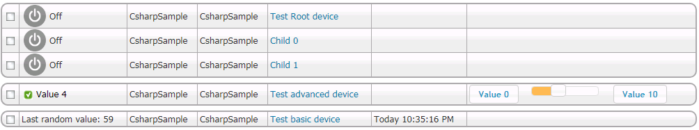

# hspi_CsharpSample
C# sample for HomeSeer 3 plugins. "Translated" from MoskusPlugin in vb.net.
https://forums.homeseer.com/forum/developer-support/programming-plug-in-development/plug-in-development/90775-hspi_moskussample-an-easier-plugin-sample-vb-net

The plugin is based on the samples from HomeSeer Tech, but  comments are added from the SDK and online help (and links to it so that it's easier accessible).

**FAQ below.**

Q: "What does this plugin do?"
A: Nothing very useful, it just does "something" to get you started. Heres a quick summary:
1. It generates a random value every X minutes or seconds (this Is user changeable by a settings page). This is used to show how triggers and conditions work. See the region "Trigger Interface".

2. It generates different types of devices, just to show how that could be done and how the plugin reacts to usage of the different controls (CAPI). See the sub "CheckAndCreateDevices".

3. It shows how text, values and even custom objects can be stored in a device, and how you create your own "Tab" on the device settings. See subs "ConfigDevice" and "ConfigDevicePost".

4. It has a simple settings page that demonstrate how you can update settings for your plugin.

Q: "What do I need?"
A: You need Visual Studio (Visual Studio Community Edition should work just fine), HomeSeer 3 running either locally or on a remote computer, some spare time (the more, the better), and an appetite for coding.

Q: "Where do I start?"
A: 1. Copy "HomeSeerAPI.dll", "HSCF.dll" and "Scheduler.dll" from your HS3 dir to into the dir of this project (extract the zip file first, of course).
2. Just start HS3 if its not running, and hit Debug in Visual Studio. Then youll see whats going on
3. Do some customization, I suggest start by naming your plugin. this is done several places:
a. In "utils.vb", see variables "IFACE_NAME" and "INIFILE".
b. See in "My Project" in the Solution, and change both
c. If you, like me, dont want the solution and project named "MoskusSample" you can edit the .vbproj and .sln files in notepad (but close Visual Studio first).
4. Then look into the "Plugin.vb" file. A good place like any other is to start by finding the sub "InitIO", whats where the plugin is initialized.
5. However, if you REALLY want to dive right in to it, find the "UpdateTimerTrigger" sub and read to the end.

Here's a screenshot of the devices the plugin creates (Image from the vb.net version):

The sample demonstrates a few different methods for creating devices and how to handle input and output of data.

Here's a screenshot of Event triggers and actions (Image from the vb.net version):

The sample has two Triggers. One without subtriggers and one with. Both can be used as a condition. See Enums "TriggerTypes" and "SubTriggerTypes" which I've added to make "(int) TrigInfo.TANumber" and "(int) TrigInfo.SubTANumber" more understandable.

The plugin have just one action, but most of the same logic applies also applies to actions.

This sample doesn't magically make writing plugins super easy. It still requires some time to understand how it is pieced together. But hopefully it will get you started.

If you know what you are doing and have comments of what I can do better, then please feel free to let me know. Share code if you can. 

